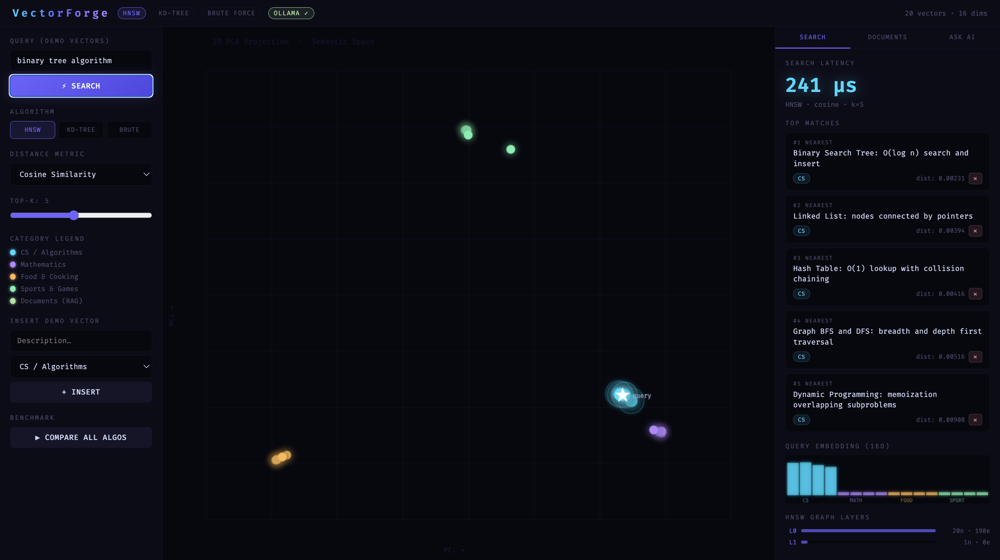
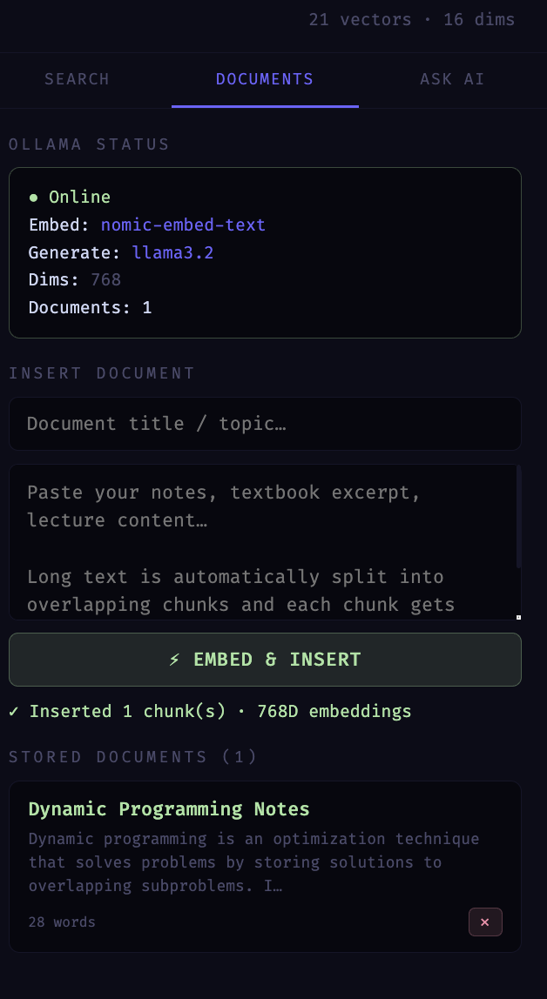
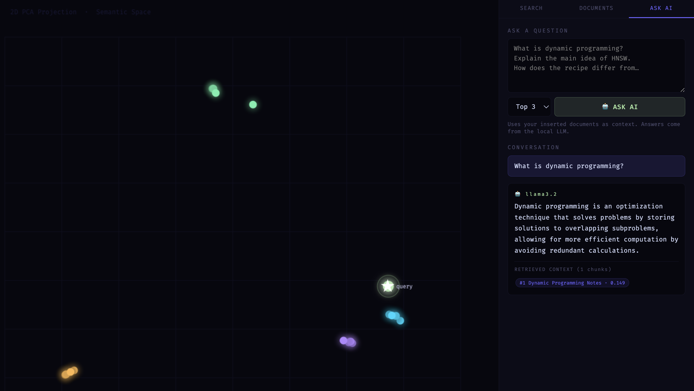
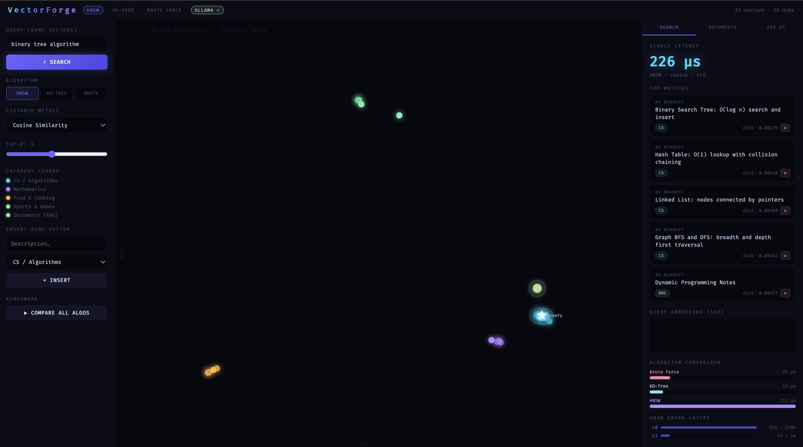

# VectorForge

VectorForge is a C++-based local Vector Database and Retrieval-Augmented Generation (RAG) application. It integrates multiple vector search algorithms with Ollama for local embedding generation and LLM inference, enabling semantic search, document retrieval, and AI-powered question answering through an interactive web interface.

---

## Screenshots

### Home Dashboard



### Document Management



### AI-Powered Question Answering



### Algorithm Benchmark



---

## Features

- Semantic vector search over stored documents
- Multiple search algorithms
  - HNSW
  - KD-Tree
  - Brute Force
- Multiple similarity metrics
  - Cosine Similarity
  - Euclidean Distance
  - Manhattan Distance
- Document embedding using Ollama
- Retrieval-Augmented Generation (RAG)
- Interactive web dashboard
- Search latency comparison
- REST API for document and vector management

---

## Tech Stack

### Backend
- C++17
- cpp-httplib

### AI
- Ollama
- llama3.2
- nomic-embed-text

### Frontend
- HTML
- CSS
- JavaScript

---

## Project Structure

```
VectorForge/
│
├── main.cpp
├── httplib.h
├── index.html
├── README.md
└── .gitignore
```

---

## Workflow

```
User Query
      │
      ▼
Generate Query Embedding
(nomic-embed-text)
      │
      ▼
Vector Search
(HNSW / KD-Tree / Brute Force)
      │
      ▼
Retrieve Top Matching Documents
      │
      ▼
Provide Context to LLM
(llama3.2)
      │
      ▼
Generate Response
```

---

## Getting Started

### Prerequisites

Install the following software:

- Git
- Ollama
- C++17 compatible compiler (GCC or Clang)

### Install Required Models

```bash
ollama pull nomic-embed-text
ollama pull llama3.2
```

### Clone the Repository

```bash
git clone https://github.com/tiya707/VectorForge.git
cd VectorForge
```

### Compile

**macOS / Linux**

```bash
g++ -std=c++17 -O2 main.cpp -o db
```

**Windows (MinGW)**

```bash
g++ -std=c++17 -O2 main.cpp -o db -lws2_32
```

### Run the Application

Start Ollama:

```bash
ollama serve
```

Run the application:

```bash
./db
```

Open your browser:

```
http://localhost:8080
```

---

## Application Overview

### Search

- Perform semantic vector search
- Compare different indexing algorithms
- Select different similarity metrics
- View search latency

### Documents

- Insert text documents
- Generate embeddings using Ollama
- Store document vectors for retrieval

### Ask AI

- Ask questions about uploaded documents
- Retrieve relevant document context
- Generate responses using llama3.2

---

## REST API

| Method | Endpoint | Description |
|---------|----------|-------------|
| GET | `/search` | Perform vector search |
| POST | `/insert` | Insert a vector |
| DELETE | `/delete/:id` | Delete a vector |
| GET | `/items` | List stored vectors |
| POST | `/doc/insert` | Insert a document |
| POST | `/doc/ask` | Ask questions using RAG |
| GET | `/status` | Check Ollama server status |

---

## Future Improvements

- PDF and document upload support
- Persistent vector storage
- Batch document indexing
- Streaming LLM responses
- User authentication
- Dark mode
- Performance benchmarking dashboard

---

## License

This project is licensed under the MIT License.